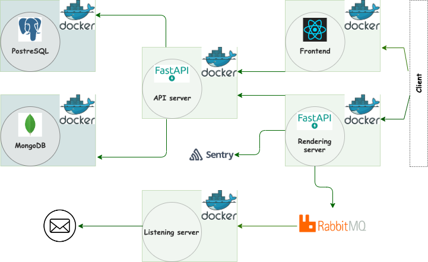

# Articles navigator
A dockerized FastAPI App with 2 options of rendering (server-side and React frontend).
Provides the oppotunity for users' articles navigation with standart user authentication system.
 
____
PostgreSQL is used for collecting data about users and their articles, MongoDB is used for registrating events.
____

### CodeClimate and CI status
<a href="https://codeclimate.com/github/Dddarknight/articles-api/maintainability"></a> <a href="https://codeclimate.com/github/Dddarknight/articles-api/test_coverage"></a> [](https://github.com/Dddarknight/articles-api/actions)

## Links
This project was built using these tools:
| Tool | Description |
|----------|---------|
| [FastAPI](https://fastapi.tiangolo.com/) | "Web framework for building APIs with Python" |
| [PostgreSQL](https://www.postgresql.org/) |  "An open source object-relational database system" |
| [SQLAlchemy](https://www.sqlalchemy.org/) |  "The Python SQL toolkit and Object Relational Mapper" |
| [Alembic](https://alembic.sqlalchemy.org/en/latest/) |  "A lightweight database migration tool for usage with the SQLAlchemy" |
| [MongoDB](https://www.mongodb.com/) |  "A NoSQL database program" |
| [React](https://reactjs.org/) |  "A JavaScript library for building user interfaces" |
| [RabbitMQ](https://www.rabbitmq.com/) | "An open source message broker" |
| [poetry](https://python-poetry.org/) |  "Python dependency management and packaging made easy" |
| [Py.Test](https://pytest.org) | "A mature full-featured Python testing tool" |
| [Sentry](https://sentry.io/welcome/) | "Application Monitoring and Error Tracking Software" |


## Installation
```
$ git clone git@github.com:Dddarknight/articles-api.git
$ touch .env

You have to fill .env file. See .env.example.
(You will have to fill username and password fields for PostgreSQL, RabbitMQ, email.
To get a SECRET_KEY for FastAPI run: $ openssl rand -hex 32)

$ cd frontend
$ touch .env

You have to fill .env file in frontend for Firebase project configuration. See .env.example.

$ cd ..

$ docker-compose up -d --build
```

## Description and usage
|   | Description |
|----------|---------|
| Registration |  First you need to register in the app using the provided form of registration. |
| Log in | Then you have to log in using the information you've filled in the registration form. |
| Users | You can see all users on the relevant page. You can change the information only about yourself. |
| Articles | Here you can see the list of users' articles. Only authorized user's article can be changed.|

## License
[GNU GPLv3](https://choosealicense.com/licenses/gpl-3.0/)